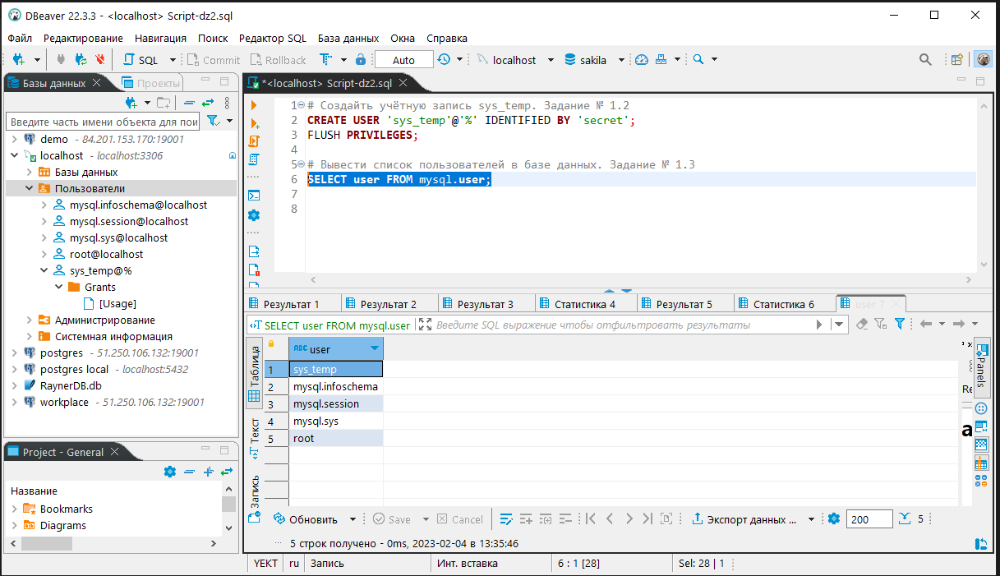
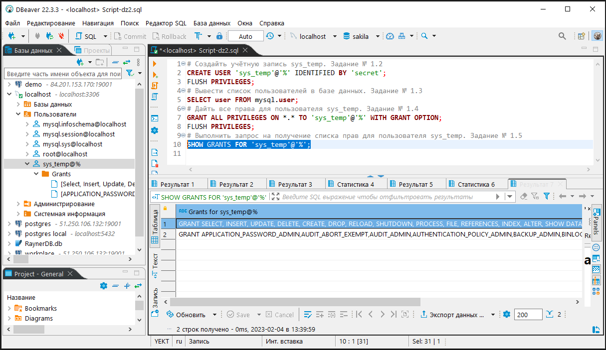
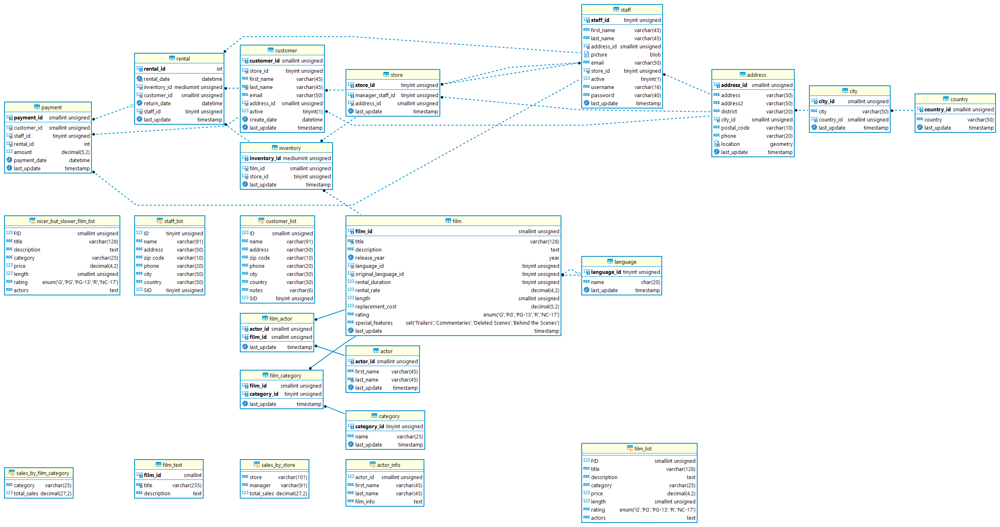
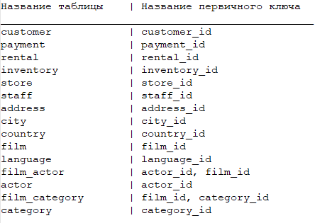
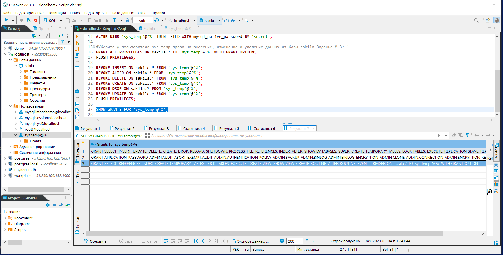
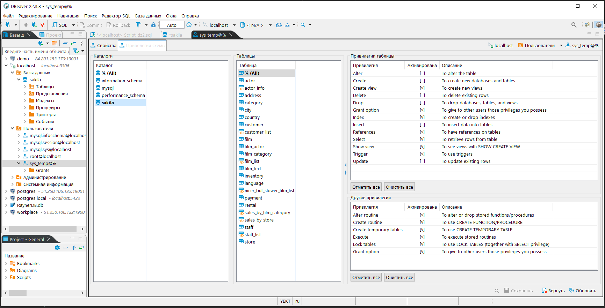

# Домашнее задание к занятию "Работа с данными (DDL/DML)" - `Тимохин Виталий`

Задание можно выполнить как в любом IDE, так и в командной строке.

### Задание 1.

1.1. Поднимите чистый инстанс MySQL версии 8.0+. Можно использовать локальный сервер или контейнер Docker.

`Выполнено`

1.2. Создайте учётную запись sys_temp. 
```sql
CREATE USER 'sys_temp'@'%' IDENTIFIED BY 'secret';
FLUSH PRIVILEGES;
```
1.3. Выполните запрос на получение списка пользователей в базе данных. (скриншот)

`Выполним запрос:`
```sql
SELECT user FROM mysql.user
```
`Результат выполнения запроса:`



1.4. Дайте все права для пользователя sys_temp. 

`Выполним запрос:`

```sql
GRANT ALL PRIVILEGES ON *.* TO 'sys_temp'@'%' WITH GRANT OPTION;
FLUSH PRIVILEGES;
```
1.5. Выполните запрос на получение списка прав для пользователя sys_temp. (скриншот)

`Выполним запрос:`

```sql
SHOW GRANTS FOR 'sys_temp'@'%';
```

`Результат выполнения запроса:`




1.6. Переподключитесь к базе данных от имени sys_temp.

Для смены типа аутентификации с sha2 используйте запрос: 
```sql
ALTER USER 'sys_test'@'localhost' IDENTIFIED WITH mysql_native_password BY 'password';
```

`Выполним запрос:`

```sql
ALTER USER 'sys_temp'@'%' IDENTIFIED WITH mysql_native_password BY 'secret';
```

`Переподключимся к MYSQL с помощью DBeaver под пользователем sys_temp`


1.6. По ссылке https://downloads.mysql.com/docs/sakila-db.zip скачайте дамп базы данных.

`Выполнено`

1.7. Восстановите дамп в базу данных.
`Выполнено`
1.8. При работе в IDE сформируйте ER-диаграмму получившейся базы данных. 
При работе в командной строке используйте команду для получения всех таблиц базы данных. (скриншот)
*Результатом работы должны быть скриншоты обозначенных заданий, а также простыня со всеми запросами.*

`ER-диаграммf базы данных sakila`

 
 
`Файл с` [SQL запросами](requests/Script-dz2.sql)

### Задание 2
Составьте таблицу, используя любой текстовый редактор или Excel, в которой должно быть два столбца: в первом должны быть названия таблиц восстановленной базы, во втором названия первичных ключей этих таблиц. Пример: (скриншот/текст)

```
Название таблицы | Название первичного ключа
customer         | customer_id
```

`Получили таблицу:`



`Файл с` [таблицей](txt/tables_pkeys.txt)

## Дополнительные задания (со звёздочкой*)
Эти задания дополнительные, то есть не обязательные к выполнению, и никак не повлияют на получение вами зачёта по этому домашнему заданию. Вы можете их выполнить, если хотите глубже шире разобраться в материале.

### Задание 3*
3.1. Уберите у пользователя sys_temp права на внесение, изменение и удаление данных из базы sakila.
`Ранее пользователю sys_temp были выданы привелегии ко всем базам данных MYSQL для хоста  '%'.`
`Чтобы отозвать заданные привелегии для базы данных sakila, сначала выдаем все привелегии `
`пользователю sys_temp для базы данных sakila.`

`Выполним запрос:`

```sql
GRANT ALL PRIVILEGES ON sakila.* TO 'sys_temp'@'%' WITH GRANT OPTION;
FLUSH PRIVILEGES;';
```

`Отзовем привелегии INSERT, ALTER, DELETE, CREATE, DROP, UPDATE у пользователя 'sys_temp'@'%' для базы данных sakila.

`Для наглядности запрос выполним ввиде отдельных запросов:` 

```sql
REVOKE INSERT ON sakila.* FROM 'sys_temp'@'%';
REVOKE ALTER ON sakila.* FROM 'sys_temp'@'%';
REVOKE DELETE ON sakila.* FROM 'sys_temp'@'%';
REVOKE CREATE ON sakila.* FROM 'sys_temp'@'%';
REVOKE DROP ON sakila.* FROM 'sys_temp'@'%';
REVOKE UPDATE ON sakila.* FROM 'sys_temp'@'%';
FLUSH PRIVILEGES;
```

3.2. Выполните запрос на получение списка прав для пользователя sys_temp. (скриншот)

*Результатом работы должны быть скриншоты обозначенных заданий, а также простыня со всеми запросами.*

`Выполним запрос:`

```sql
SHOW GRANTS FOR 'sys_temp'@'%';
```


`Результат выполнения запроса:`



`Более наглядно средствами DBeaver`



`Файл с` [SQL запросами](requests/Script-dz2.sql)
